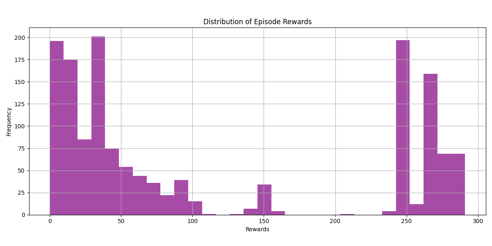

# Atari Breakout using Deep Reinforcement Learning

This project implements an advanced Deep Q-Network (DQN) agent to learn and play the Atari Breakout game using reinforcement learning techniques. The agent is trained using a combination of:

* **Double DQN**
* **Prioritized Experience Replay (PER)**
* **N-step returns**

The project also contains the following parts
* **Noisy Networks**
* **Dueling Networks**

---

## Algorithm Highlights

* **Double DQN**: Reduces overestimation bias by decoupling action selection from evaluation.
* **Prioritized Experience Replay**: Samples important transitions more frequently for faster and stable learning.
* **N-Step Returns**: Helps with reward propagation and stabilizes learning for delayed rewards.
* **Noisy Networks**: Replaces ε-greedy with parametric exploration using noise layers.
* **Duelinng Networks**: Breaks the q values into 2 parts, i.e. the value + advantage of being in that state.

---

## Project Structure

```
├── DQN_Architecture.py                   
├── PER.py                               
├── Agent_Implementation.py         
├── Atari_Environment.py                
├── Image_Processing_and_Frame_Stacking.py 
├── training_function.py
├── Visualisation_and_plotting.py           
├── Main.py                                
├── Test.py                           
├── config.py 
├── NOISY_Dueling_DQN.py                               
└── README.md
```

---

## Getting Started

### 1. Clone Respository

```git
git clone "https://github.com/vishesh-kumar-singh/Atari-Breakout-DoubleDQN.git"
```

### 2. Install Dependencies
Create a seperate environment and in that environment run

```bash
pip install requirements.txt
```

### 3. Run the Model
```bash
python Test.py
```

---

## Configuration

Edit `config.py` to tune hyperparameters like:

```python
config = {
    "gamma": 0.99,
    "learning_rate": 1e-4,
    "buffer_size": 100000,
    "batch_size": 32,
    "alpha": 0.6,
    "beta_start": 0.4,
    "n_step": 3,
    "target_update_freq": 1000,
    "initial_replay_size": 5000,
}
```
---
## Training Methods and Results

* Model had initialy been trained using Doble-Deep Q Network for 2000 episode, which resulted average of last 50 scores to be of 81.60
* After this, N-step Learning method was applied.
* Instead of training from scratch, the neural network was initialized with the old model weights.
* This gave a better starting point for the network than random initialisation.
* After training for 1500 episodes, model reached an average score of 169 for last 50 training episodes.


The agent can be simply trained by:

```bash
python Main.py
```
But this logic **trains the existing model** over more episodes. That is to fine-tune, because the current logic was used to retrain the model for N-step Learning<br>

**To train the model from scratch**. Remove lines 12 and 13 from Main.py then run

```bash
python Main.py
```

### 3. Test the Trained Model

```bash
python Test.py
```

---
## Training Overview
- Reward Distribution while Second Training Round:

- Rewards, Mean Score, Loss in training Process

---
## Using Noisy Nets and Dueling Networks

Noisy Nets and Dueling networks can further enhance the model performance, but For using Noisy nets and Double DQN you need to replace line 70-85 in Agent_Implementation.py with
```
        state_tensor = torch.tensor(state, dtype=torch.float32).unsqueeze(0)
        state_tensor = state_tensor.to(self.policy_net.device)
        # Get Q-values from the policy network and select action with max Q-value.
        with torch.no_grad():
            q_values = self.policy_net(state_tensor)
        return q_values.argmax().item()
```
and add the following to line 130 in Agent_Implementation.py
```
        policy_net.reset_noise()
```
---

## Acknowledgements

- <a href=https://arxiv.org/pdf/1312.5602>Playing Atari with Deep Reinforcement Learning</a>
- <a href=https://arxiv.org/pdf/1509.06461>Deep Reinforcement Learning with Double Q-learning</a>
- <a href=https://arxiv.org/pdf/1511.05952>Prioritized Experience Replay</a>
- Reinforcement Learning: An Introduction (Sutton and Barto) for N-step Learning
- <a href=https://arxiv.org/pdf/1511.06581>Dueling Network Architectures for Deep Reinforcement Learning</a>
- <a href=https://arxiv.org/pdf/1706.10295>Noisy Networks for Exploration</a>

---

## License

This project is licensed under the MIT License. See `LICENSE` for details.

---
